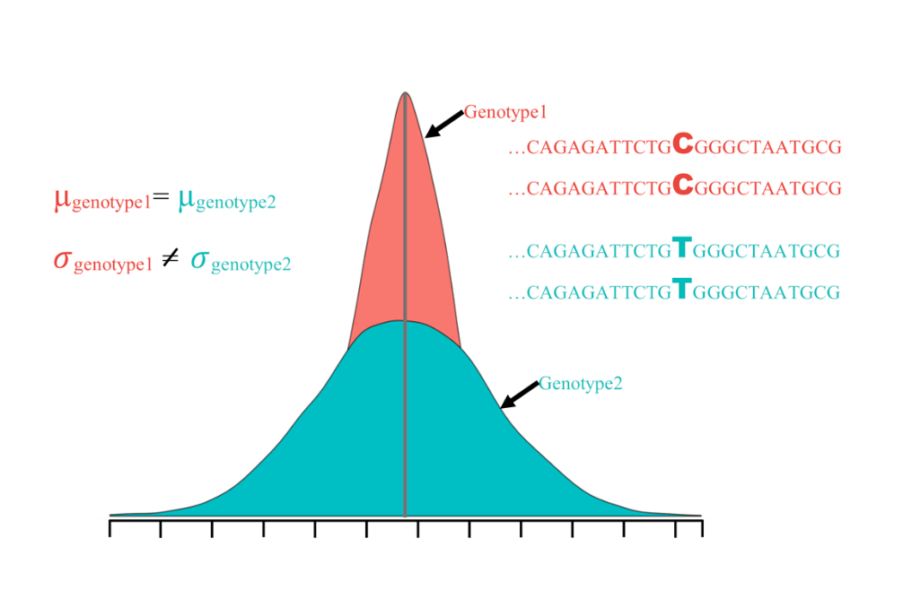

# General
This repository  contains all the scripts and data used for the manuscript: "Variance-heterogeneity genome-wide mapping for cadmium in bread wheat revealed novel genomic loci and epistatic interactions".  Full length paper is available at [https://acsess.onlinelibrary.wiley.com/doi/abs/10.1002/tpg2.20011](https://acsess.onlinelibrary.wiley.com/doi/abs/10.1002/tpg2.20011). 

***
## Varaince-heterogeneity QTL 

***

###### Aim: The main purpose of this work was to model the variance-heterogeneity in the context of GWAS, called as vGWAS to seek the genomic regions affecting the variance-heterogeneity of grain cadmium content in hard-red winter wheat.
***
# Content of the repository
***

- Raw data files used in this study is given in **Data folder**.
- All the figures generated are in the **Figures** folder.
- **html** folder contains the html file containing all the R scripts.
- R scripts are also given as ***.rmd*** files in rmd folder

- [R Scripts_HTML](https://htmlpreview.github.io/?https://github.com/whussain2/vGWAS/blob/master/html/all.html)
- [.rmd](https://github.com/whussain2/vGWAS/blob/master/rmd_files/all.Rmd)
- [Multiple_testing_Scripts](https://github.com/whussain2/vGWAS/blob/master/rmd_files/multiple_testing.Rmd)

