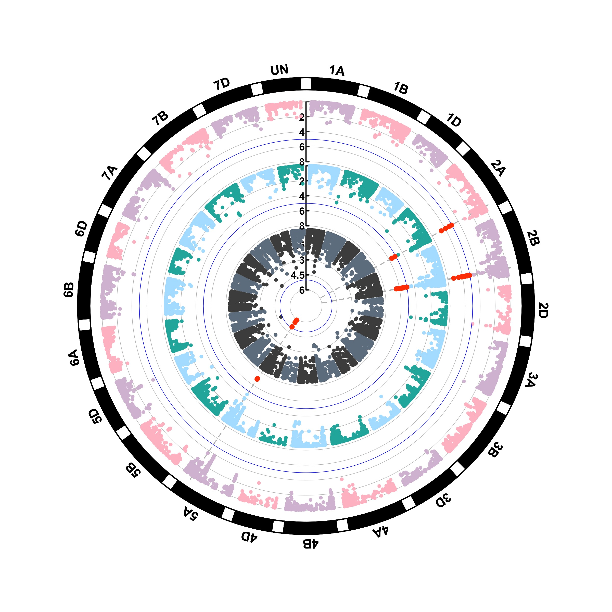

# vGWAS
This repository  contains all the scripts and data used for the manuscript: "Variance-heterogeneity genome-wide mapping for cadmium in wheat revealed novel genomic loci and candidate genes"

# Deatails comming soon!
